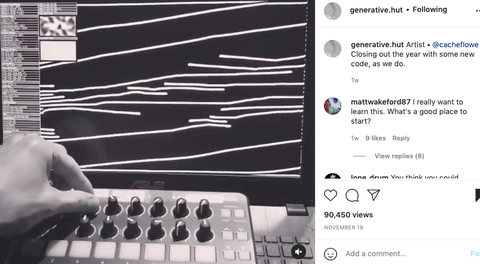

# Final Project!
To create anything interactive!! Here is a journal to document my journey:

## Brainstorm 
I was thinking about an interactive art piece where the performer can alter the things on screen based on their interactivity. 

This is what I was inspired by:

Giving the artist/audience agency in the interaction of this art. I'm not sure where this can take me just yet, but I really really liked this idea and would like to discuss more with Prof Shiloh about this idea :)

You can find the video via: https://www.instagram.com/p/CWc0pGNss1L/

Ever since I started Introduction to Interactive Media, I have been an avid follower of these coded art online and seek lots of inspiration from these works!!

## Inspiration

I was very inspired by the National Day Celebration and the fireworks that were occuring in various locations across Abu Dhabi. I decided to visit the Corniche and managed to capture a few videos/photos that became my main inspiration to my final project. 

I then coded and followed along with Daniel Shiffman, learning how to code the basic movements of fireworks on Processing. 
Here is a link of his video: https://www.youtube.com/watch?v=CKeyIbT3vXI

