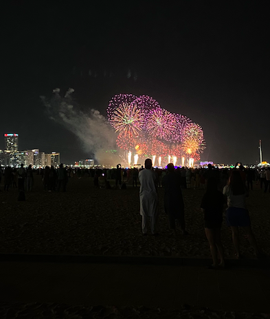
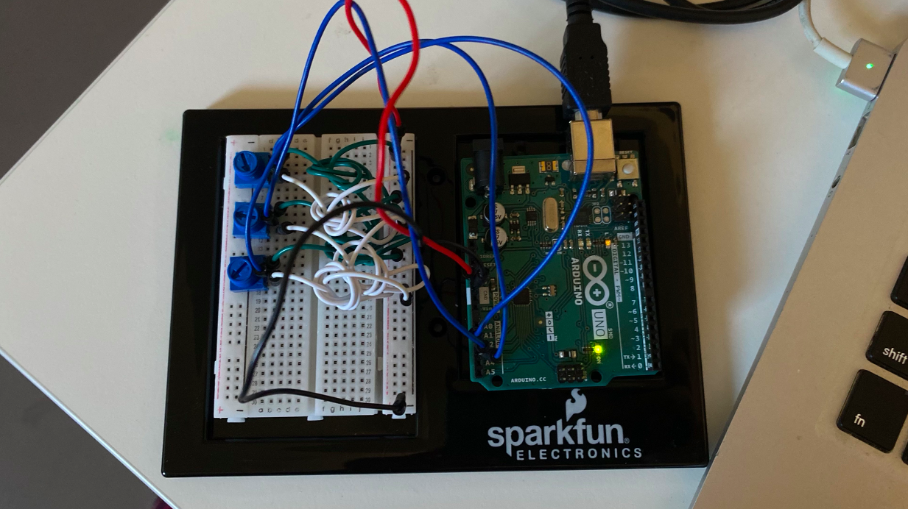
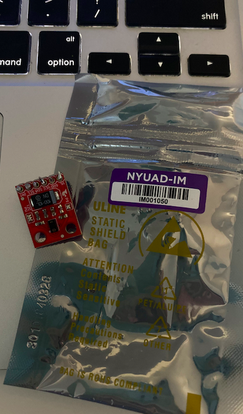

# Final Project!
To create anything interactive!! Here is a journal to document my journey:

## Brainstorm 
I was thinking about an interactive art piece where the performer can alter the things on screen based on their interactivity. 

This is what I was inspired by:

Giving the artist/audience agency in the interaction of this art. I'm not sure where this can take me just yet, but I really really liked this idea and would like to discuss more with Prof Shiloh about this idea :)

You can find the video via: https://www.instagram.com/p/CWc0pGNss1L/

Ever since I started Introduction to Interactive Media, I have been an avid follower of these coded art online and seek lots of inspiration from these works!!

## Inspiration

I was very inspired by the National Day Celebration and the fireworks that were occuring in various locations across Abu Dhabi. I decided to visit the Corniche and managed to capture a few videos/photos that became my main inspiration to my final project. 

I then coded and followed along with Daniel Shiffman, learning how to code the basic movements of fireworks on Processing. 
Here is a link of his video: https://www.youtube.com/watch?v=CKeyIbT3vXI

## Progress
1. I first played around with the dots appearing, but having arduino control the speed/size of these dots without any form of animation. 

https://drive.google.com/file/d/1tK4HaU8lEHB4B-jTI-Ae95G2i9qIoQPp/view?usp=sharing

2. I then created an animation of the fireworks, inspired by Daniel Shiffman, and began to integrate the two together.

https://drive.google.com/file/d/1j5a73FVZGMEuMsx8WUAU8ISXr3E7L5c9/view?usp=sharing

3. I finally got a final project which you find on gitHub, which shows how you can control the fireworks with the values of three potentiometers. 

4. User feedback!

- Abdul: This project is simple but very very innovative. I love the way you let the users manipulate and create a firework landscape of their own. I do wish that it was more immersive, so adding some element of sound would add to the interactivity of the project. 

- Fatema: I love looking at animated fireworks, my favorite was the way you can control the size of the firework bursts. I wonder whether there is a way to project this as if it were actual fireworks. Perhaps you can use a projector or a bigger screen to mimic the actual size of these fireworks. 

5. After testing my project with peers, I decided to add some element of sound. So with every burst in the air, I added an element of firecracker. 

https://drive.google.com/file/d/1ZhSRbEOze75zE0iL8fk6XcCUTcTSwswX/view?usp=sharing

6. Adding color!! I decided that I wanted to manipulate and change the colors of the fireworks with a sensor. At first, I thought of using the color sensor and to wire it from Arduino.

However, I ended up with using the web camera on my computer by reading the pixels and collecting the average pixel color that will be used in the 'fill()' function of the fireworks. 

## Challenges

The biggest challenge for me was definitely the first half of the project. I spent a lot of time on refining the code for serial communication between Arduino and Processing, referring to both class notes and examples for help. The importance of 'handshaking' was really important especially when you are working with data and string events. It became easier and easier after figuring out the communication for the first potentiometer. 

## Reflection

The journey of Intro to Interactive Media hasn't been an easy one for me, but I am really happy with how far I have come. My favorite part of this final project was building the breadboard for Arduino. Everything - from the potentiometer, 5V, GND, and wires - seem to make logical sense in my brain and I built it very fast. I really appreciate this 'hands-on' part. Writing the code and communication between the two was perhaps the biggest challenge for me. I am also very happy with my project and enjoyed the process of it all. I recall even listening to Katy Perry's 'Fireworks' while coding this final project with friends to draw inspiration and motivate myself. 
