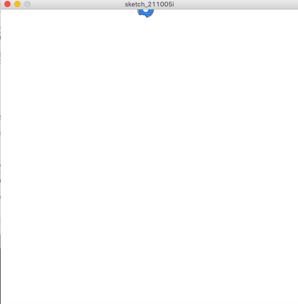
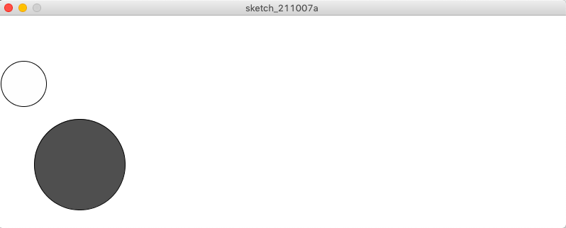

# Midterm

Yes - you've guessed it! We have already reached our mid-term project and I am absolutely terrified.

## Synopsis:

Make a game using everything we have learned so far. Can be one or more players. Some required elements: 
- one shape
- one image
- one sound
- one on-screen text

The game must:
- start with a screen giving instruction
- wait at the start screen until a button or key (your choice) is pressed
- after the game is won or lost, there must be a way to restart the game wihtout closing and restarting the program

## What I did:

**Oct 1 - I started by playing with images, transformation, and inserting images.**

This is an animation of a donut rotating across the x-axis.  
I wasn't very happy with what it produced, but I used similar concepts in terms of code for my next idea. 

**Oct 3 - I started to incorporate the code to animate two circles.**

This is an animation of two circles bouncing off the walls. I used codes from my first initial idea and was later inspired by an example on the Processing Library. Am still unsure where I want my midterm game to go (I realize that I was too inept to produce anything fancy, so decided to explore and adapt as I learned new ways to code). 

**Oct 5 - I began to add new elements to this draft.**
