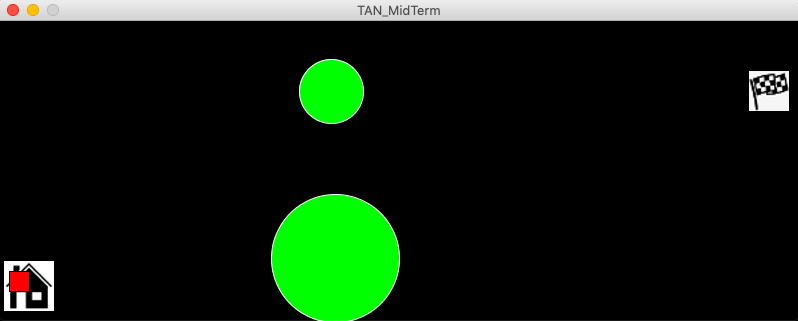

# Midterm

Yes - you've guessed it! We have already reached our mid-term project and I am absolutely terrified.

## Synopsis:

Make a game using everything we have learned so far. Can be one or more players. Some required elements: 
- one shape
- one image
- one sound
- one on-screen text

The game must:
- start with a screen giving instruction
- wait at the start screen until a button or key (your choice) is pressed
- after the game is won or lost, there must be a way to restart the game wihtout closing and restarting the program

## What I did:

**Oct 1 - I started by playing with images, transformation, and inserting images.**


This is an animation of a donut rotating across the x-axis.  
I wasn't very happy with what it produced, but I used similar concepts in terms of code for my next idea. 

**Oct 3 - I started to incorporate the code to animate two circles.**


This is an animation of two circles bouncing off the walls. I used codes from my first initial idea and was later inspired by an example found on Processing Library by Daniel Shiffman. Am still unsure where I want my midterm game to go (I realize that I was too inept to produce anything fancy, so decided to explore and adapt as I learned new ways to code). 

**Oct 5 - I began to add new elements to this draft.**


I changed the color of the background to black and circles to green so the game looks better aesthetically! 
I added the following code to animate a red square to move when directed by the arrow buttons.

````
  void update () {
    if (keyPressed) {
      if (keyCode == DOWN) {
        direction = 0;
        y+=speed;
      }
      if (keyCode == LEFT) {
        direction = 1;
        x-=speed;
      }
      if (keyCode == RIGHT) {
        direction = 2;
        x+=speed;
      }
      if (keyCode == UP) {
        direction = 3;
        y-=speed;
      } 
````

I finally inserted a picture of a flag and decided to make a game that is similarly mimics capture the flag. Players must direct the red square and avoid touching the green boulders otherwise they have to restart the game. Looking to incorporate a timer in the left hand corner to challenge the player to collect the flag as fast as they can. 

**Oct 10 - I starting working on creating new screens. **

screen 1 as an intro page,
screen 2 as the game,
screen 3 as the won/lost page.





**Oct 10 - I decided to replace 'timer' with'homeBase,' and added some music.**

````
Game game; 

import processing.sound.*;
SoundFile music;

void setup() {
  game = new Game ();
  size(800, 300);

  music = new SoundFile (this, "mixkit-retro-game.mp3");
  music.loop ();
  music.play();
}
void draw() {

  background(0);
  boolean playing = true; // for the music
  game.display (); 
  if (game.screen == 3 && mousePressed) { 
    println ("here");
    game = new Game (); // creating a new game once mouse is pressed
  }
````
**Oct 12 - And that's the final outcome!!** :)


