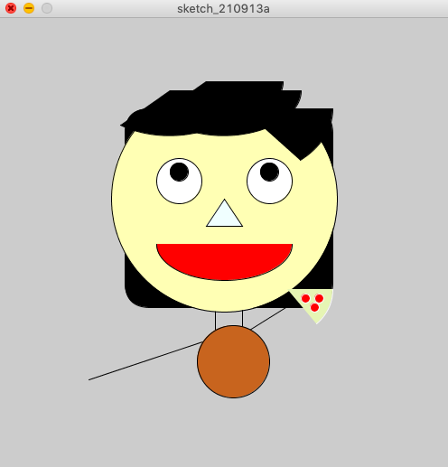

# Week 1: Self Portrait 
## Synopsis:
Our assignment was to create a self-portrait of ourself using Processing.
## What I did:
To complete this task I decided to play around with the shapes that we practiced in class. 
I used a combination of circles, rectangles, and lines. Using the 'fill' function to also experiment with colors and shades.
## Outcome

## Challenges
The biggest challenge for me was trying to get shape placement correctly with coordinates. I found it really really hard imagine where the shapes would be 'played.' 
This is also my first time using any code and I found it really hard to grapple with the language and numbers used. 
## Reflections
This first assignment was definitely fun but frustrating. I really want to learn and explore how to use the animated function with 'draw.' 
I stuck with the static function this assignment as I was a little nervous with coding language and wanted to practice the basics first.
I'm not sure how I feel about my final outcome, but I do hope that I can better grapple with coding in the next few weeks so that I can produce something that I feel more proud of. But as of now, I'm telling myself baby steps. :)
