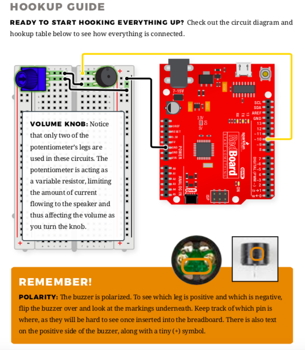

# Week 10: Arduino Musical Instrument
Make a musical instrument!

## Synopsis:
Our assignment was to create a musical instrument with Arduino and to fulfill the following criterions:

- You must use at least one digital sensor (switch)
- You must use at least one analog sensor (photoresistor, potentiometer)
- You may use the distance measuring sensor if you wish

## What I did:

- step 1: 
I started this project by reviweing how to connect the buzzer and the potentiometer. I used the following schematics from the lecture notes and from the SparkFun Inventor's Kit to help strengthen my basic understanding of the two components before visualizing my final musical instrument:


- step 2: 
After I connected my buzzer, I decided to play around with creating pitches and a melody. I ended up with a melody that played the Game of Thrones main theme song. 

````

// notes in the melody:
const int melody[] = {
  NOTE_E4, NOTE_A3, NOTE_C4, NOTE_D4, NOTE_E4, NOTE_A3, NOTE_C4, NOTE_D4, NOTE_B3, NOTE_C4, NOTE_C4, NOTE_D4, NOTE_B3, NOTE_C4, NOTE_B3, NOTE_D4, NOTE_G3, NOTE_C4, NOTE_B3, NOTE_A3
};

// note durations: 4 = quarter note, 8 = eighth note, etc.:
const  int noteDurations[] = {
  2, 2, 8, 8, 4, 4, 8, 8, 1, 8, 8, 4, 4, 8, 8, 4, 4, 8, 8, 1

````

- step 3:
I decided to use the potentiometer as my analog sensor and add buttons as my digital sensors. I drew up a schematic to show what I wanted the circuit to look like and function as:


## Outcome
Overall, my final outcome consists of two main digital sensors that controls which tune is played. 


When the greenButton is HIGH, the idea is to rotate the potentiometer so that the frequency changes with it. You can find it here.

When the yellowButton is HIGH, the idea is that the Game of Thrones main theme song will play. You can find it here.

## Challenges

## Reflections
