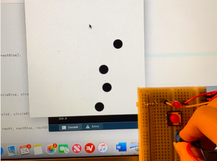
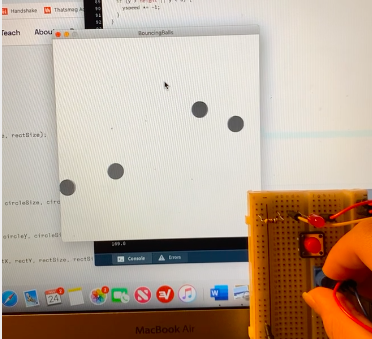
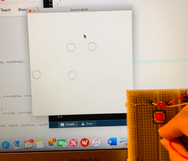
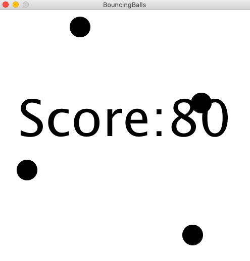

# Week 11: Production Assignment
Production assignment - make a siple game that involves some kind of communication between Arduino and Processing!


## Synopsis:
- Make something that uses only one sensor on Arduino and make the ellipse in Processing move on the horizontal axis, in the middle of the screen, and nothing on Arduino is controlled by Processing
- Make something that controls the LED brightness from Processing
- Take the gravity wind example (https://github.com/aaronsherwood/introduction_interactive_media/blob/master/processingExamples/gravityExamples/gravityWind/gravityWind.pde) and make it so every time the ball bounces one led lights up and then turns off, and you can control the wind from one analog sensor
- EXTRA CREDIT Due Nov. 24th
Make a simple game that involves some kind of communication between Arduino and Processing

## What I did:

- step 1: 
I started off with the code we first used in class to create the moving horizontal ball, then I decided to play with the code and create my own mini game. 

- step 2: 
I decided to create multiple moving balls that would bounce around on screen, and the idea would be that clicking on these balls would allow the player to accumulate point values. 

- step 3:
With every click of 'circlePressed()' the idea was to send a serial message to Arduino so that the redLEDPin would light up. 

````
  void circlePressed () {
    if (mousePressed && (dist (mouseX, mouseY, x, y) <= 20)) {
      //println("here1");
      //if we clicked on the circle
      myPort.write('0');         //send a 1
      println("0");
      value = value +10;
    } else {                           //otherwise
      myPort.write('1');        //send a 0
      value = value +0;
    }
 ````

- step 4: 
I added a potentiometer to my breadboard and decided that the value (based on the turnof the knob) will determine the color gradient of the balls on screen. This is the following schematic that I used to create this:







For a video of the change, click [Here!](https://drive.google.com/file/d/1bi9a5tlX8sPnSvS961ctIoTNRoI5MZ4x/view?usp=sharing)

- step 5:
I added a timer and a 'point' system to keep track of how many clicks acccumulated.


## Outcome
Overall, this is my final outcome!
Play [Here!](https://drive.google.com/file/d/1QIN-EHeG-M11UdtRr-tDIuZnxyG-hjFj/view?usp=sharing)


## Challenges
I generally thought that writing and understanding Serial Communication was the toughest part of the task. I rewatched the video a couple times to fully grasp the concept. Since we built and coded the potentiometer together in class, I found that a little easier to construct myself. However, getting the redLEDPin to light up was a little harder than I expected. Happy I got there in the end. 

## Reflections
In reflecting on this game, I see why there is so much potential with the Interactive Media discipline. I'm sure this is only the very surface level and that there is so much more that can be discovered and created. I am intrigued by what else is to come out of such foundational concepts: to what extent can we push the limits of interactivity between humans and computers? What artistic connections can we create out of this relationship? I am generally quite nervous for my final project as this production assignment was quite challenging for me, so I am hoping that I can harness what I have learned and apply them in the future. 
