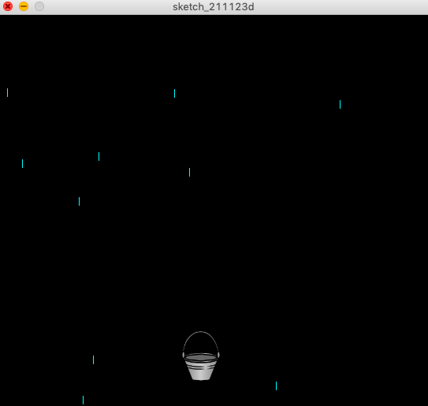
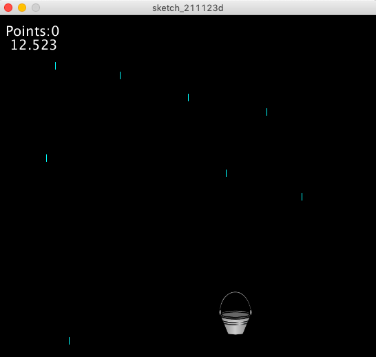
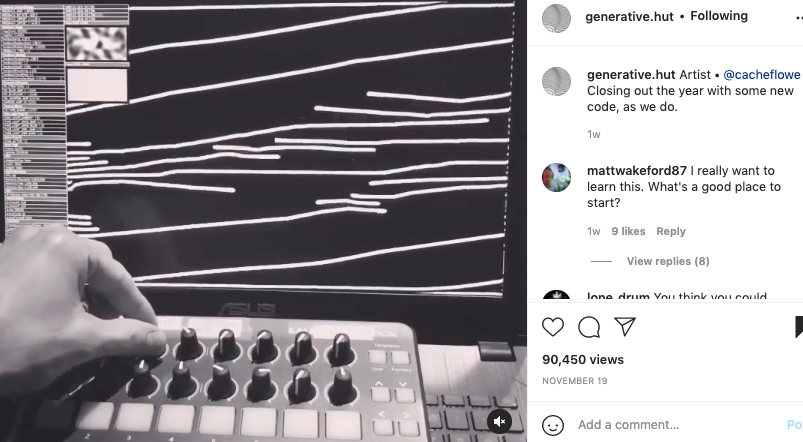

# Week 11: Final Project Brainstorm
Start thinking and brainstorm an idea for the final project!

## Synopsis 1:
I think I want my final project to be about water and scarcity. I was experimenting with this idea with Processing and Arduino. This was what I created thus far.  

- the knob is made so that the bucket will move horizontally across the screen 
- each drop collected will make the blue LED light up

- I decided to add a timer and a point system to track the number of drops collected

## Synopsis 2:
I was thinking about an interactive art piece where the performer can alter the things on screen based on their interactivity. 

This is what I was inspired by:

Giving the artist/audience agency in the interaction of this art. I'm not sure where this can take me just yet, but I really really liked this idea and would like to discuss more with Prof Shiloh about this idea :)

You can find the video via: https://www.instagram.com/p/CWc0pGNss1L/

Ever since I started Introduction to Interactive Media, I have been an avid follower of these coded art online and seek lots of inspiration from these works!!
