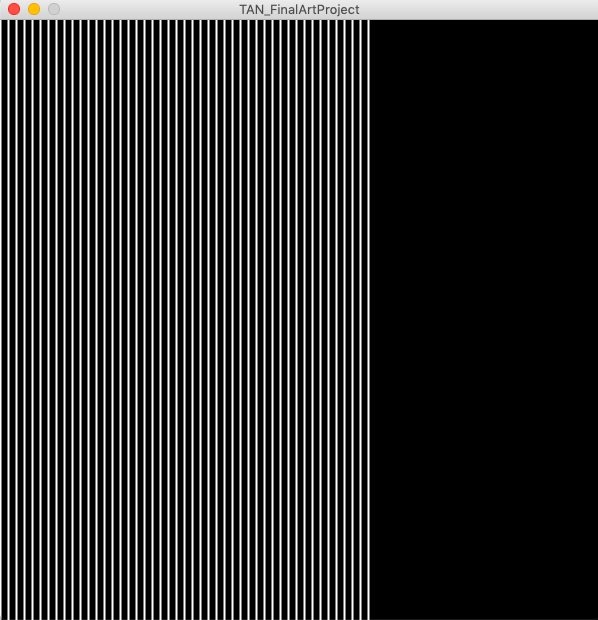
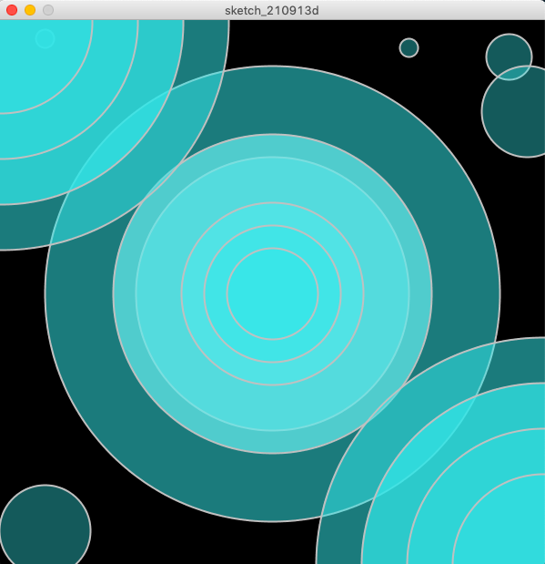

# June 2: Assignment 2

## Synopsis:

The task was to create a piece of art that used for/while loop and other code from the syntax we learned so far. 

## What I did:
I started my artwork with some of the basic animation and loops that we practiced this week. 
- step 1: 
I experimented with an animation where I coded white vertical lines appearing across the screen.

- step 2:
Then, I decided to spice up the background by adding some colored circles with different shades and tones of blue. 

- step 3:
Finally, I combined both codes and magically created something that looks quite interesting!

## Outcome

## Challenges
The biggest struggle that I encountered during this assignment was understanding the loop system in code. I thought I understood it in class, but in practice I foujd it much harder to understand. To be honest, I had to search a video on YouTube to get an extra explanation of the loop system. I finally understood in the end but am still a little unsure. 

## Reflection
Overall, I enjoyed this assignment a lot more than the first. There was greater flexibility in the art that I found myself coding and I feel slightly more comfortable with the material that I covered. I am nervous about incorporating more things in the upcoming week but am eager to practice as well. 
