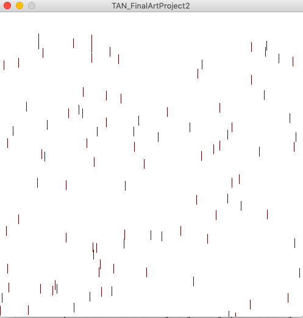
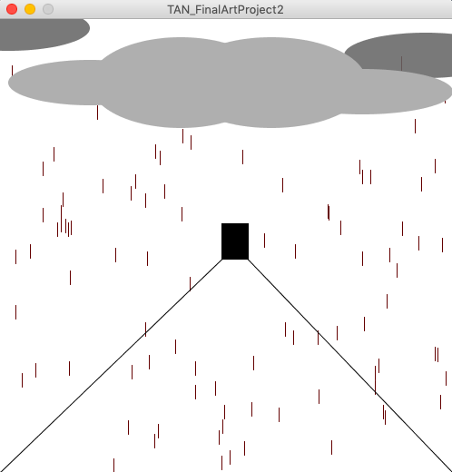
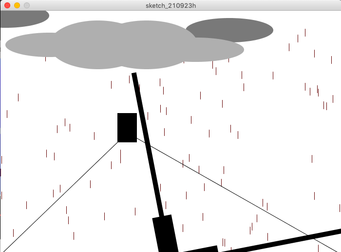

# Week 3: Art Project 2
## Synopsis:
Our assignment was to create an Object-Oriented Programming. Paying attention to structure, clarity, and organization of the program.
## What I did:
To complete this task I decided to play around with arrays that we learned in class. 
- step 1:
I first started by rewatching the assignments that we worked on in class with arrays (e.g. with the balls) and experimented there. 
I watched this extra video on Arrays to help my undersatnding: https://www.youtube.com/watch?v=NptnmWvkbTw. I then changed the balls to lines:

- step 2: 
Then, I decided to add the additional shapes and lines which was language that I was more familiar with.

- step 3: 
Next, I tried to play with rotation and Object-Orientation, so I decided to try add window wipers (like what you would see from a car window). 
But it failed - horrendous! So I decided to change it into a windmill. :)

## Outcome

## Challenges

## Reflections
I found this assignment again, very fun and frustrating. 
Fun, because I was starting to get to grips with coding language. I was more comfortable and confident with the format and structure of code. 
Frustrating, however, because I had to spend extra time on the trial/error process with arrays and object-orientation. 
Am glad that I finally could produce artwork that I am happy with. 
