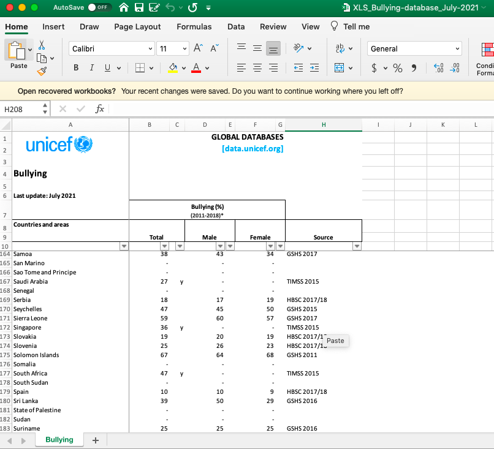
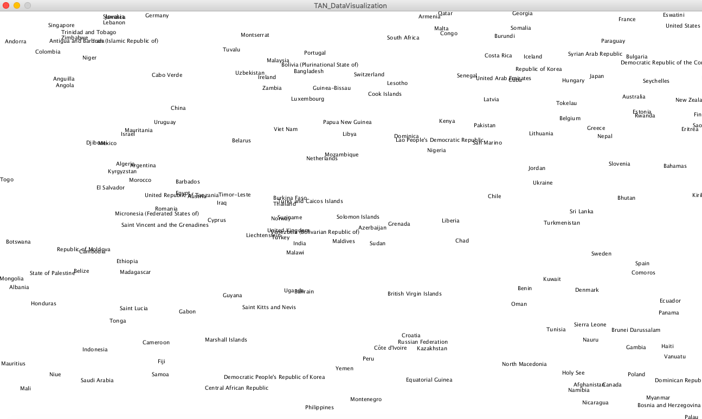
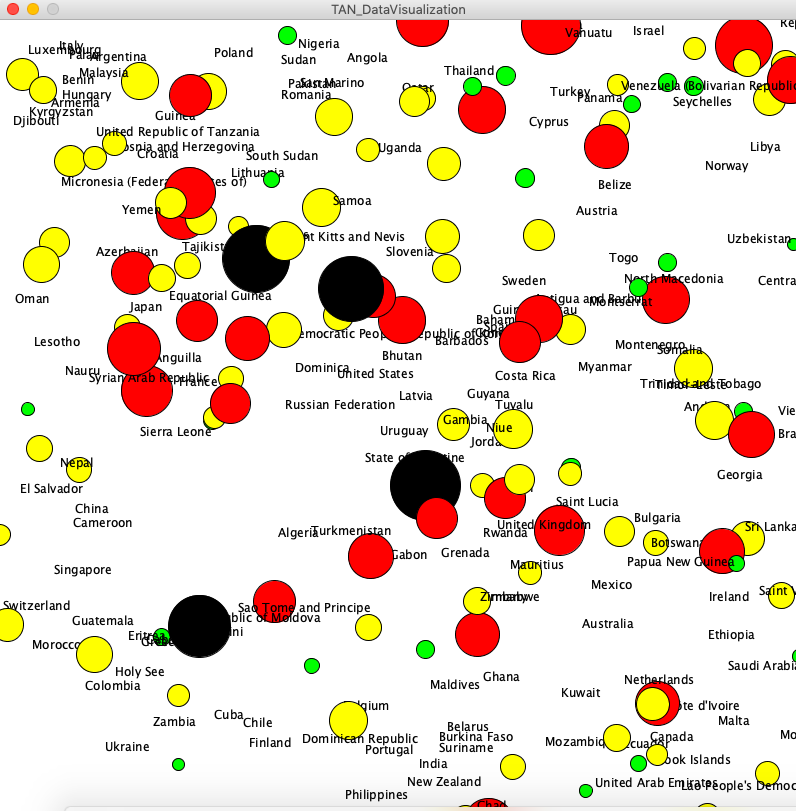
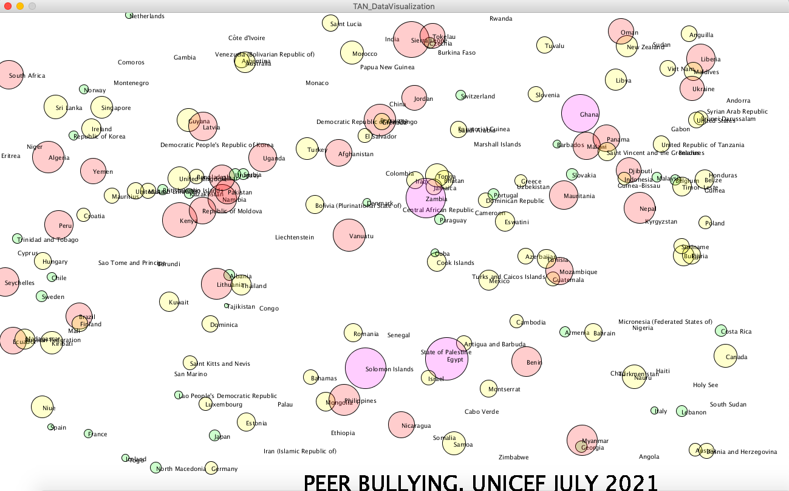

# Week 4: Data Visualization

## Synopsis:

The task was to pracetice loading data and displaying text. We had to either make some sort of data visualization of create a generative text output. 

## What I did:

- step 1:
I start my project by going on the UNICEF database to collect materials. I was interested in child development, so extracted the prevalence of Peer Bullying aroudn the world. 

- step 2: 
I converted this excel file into a CSV file.

- step 3: 
Then, I decided to practice using the println function to obtain the total number of columns/ rows/ string and float data. 

- step 4:  
I used the string data to project the countries around the world. 

- step 5: 
I finally added the circles and size base on the prevalence of bullying. 
I also tried to play with color to make the information more visually appealling and accessible.

## Outcome
This is the final outcome! I'm still unsure how to avoid the overlapping of words, so I am still working on it. But as of now, this is the final outcome that I am happy with. 

## Challenges
I'm not sure if I had forgotten what I had learned in class, but it took some time to recall how to use String Data from what I was watching in class. It always seems easy and magical when I am watching others code, but I find myself clueless when I have to do it myself. I rewatched this youtube video before starting fresh on this new project: https://www.youtube.com/watch?v=pJthD0t6k1U.

## Reflection
I overall really really enjoyed this project. It felt like I was doing something beyond the artistic form. Playing with real-life applicable data really motivated me to continue despite the frustrations. I genuinely think that this project will be something I attempt again in my free time. :-) I know I still have lots to learn, but am really appreciate interdisciplinary space between data and art.
