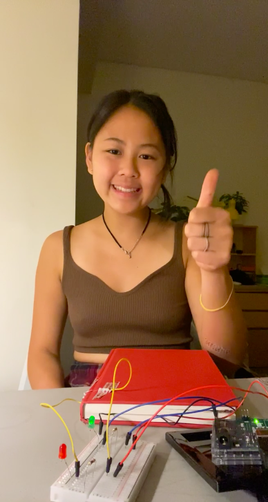

# Week 8: Creating an Unusual Switch
To get creative with swtiches!

## Synopsis:
Our assignment was to create an unusual switch, using the Arduino digital input and output for the interaction. 

## What I did:
I started this project by drawing inspiration from [here](https://itp.nyu.edu/physcomp/labs/switches/#Get_Creative_With_Switches). 
This was the link that Professor Shiloh provided for us to look at. 

- step 1: 
I first played with the breadboard, wires, LED, switch and arduino to ensure that I had a functioning circuit.

- step 2: 
I decided to draw up a schematic because I found this really helpful during class for me to visualize the flow of electricity throughout the circuit.

- step 3:
I wanted to make a switch out of an everyday activity that, when combined, could transform into a switch and turn on a light. 
So, I decided to use the closing motion of a book to create a switch.

- step 4:
I decided to add a second LED (green/red) and a second switch to my circuit. This meant that I could choose which color LED I want lit, based on whether I am reading or not. 

Reading= OK (GREEN):

Closed book = DO NOT DISTURB (RED):

- step 5:
Finally, I shortened the delay time on Arduino so that the green LED would be blink rapidly. I left the red LED remaining bright and lit. 

## Outcome
My final outcome is this video: TAN_UnusualSwitchFinal.mp4 - which you can find in the 'week 8' folder!

## Challenges
The biggest challenge for me over this project is understanding the functionality of the breadboard and trying to imagine the flow of electricity from arduino to the breadboard. I also found it difficult to come up with a creative and unusual switch. Because it was difficult for the wires to touch each other, I had to find sheets of metal that I wrapped around the coil to make sure that it has a greater surface area and sensitivity. 

## Reflections
The shift from coding to electricity is a bit of a jump for me. This last week has been a little challenging in class too. I know I can always freely ask questions in class too, but sometimes I feel like I'm not sure what I should be asking or what I might be missing out. I do enjoy the hands-on work that we do in class and my favorite part is uploading arduino code and seeing the LED light up. I found it very amusing too when I was building my circuit for the unusual switch - happy that I could take something I do in my everyday life and incorporate it.
