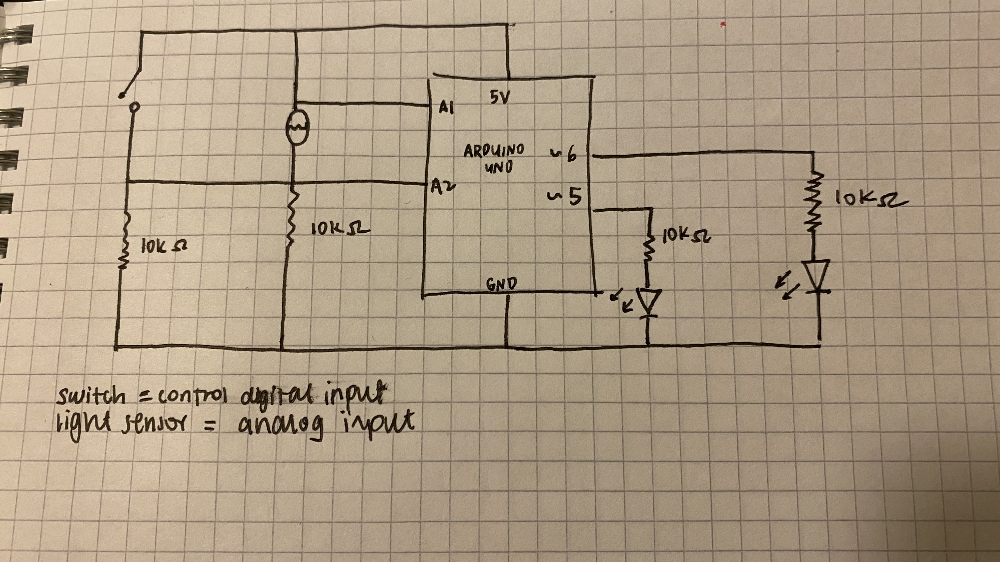
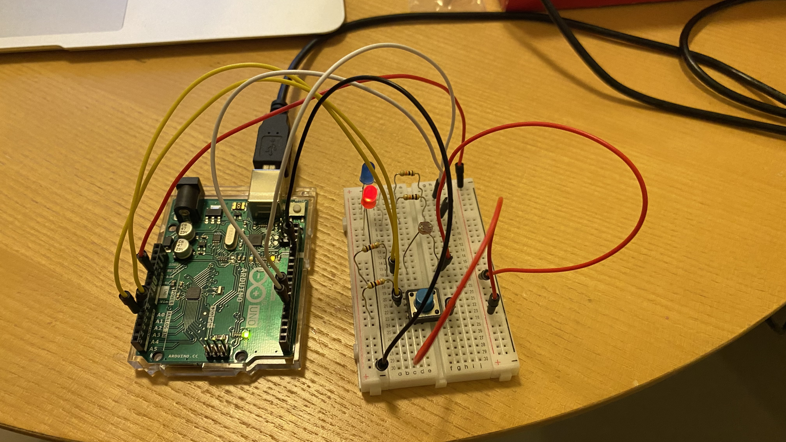
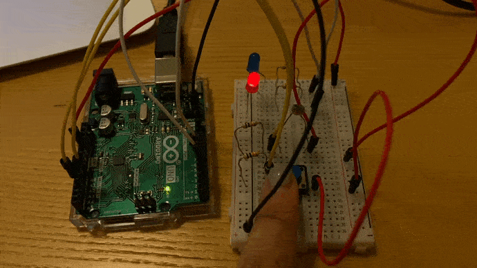
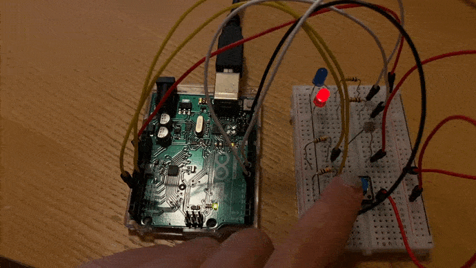
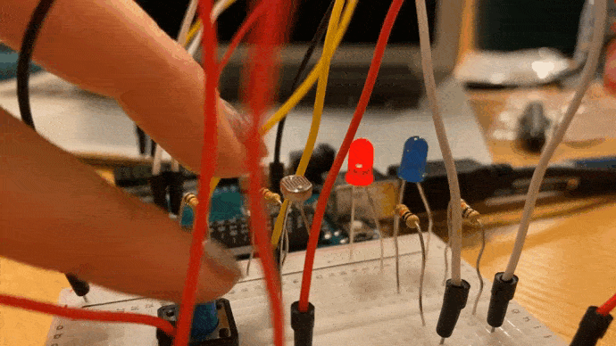

# Week 9: Analog and Digital Sensors
To get creative with analog and digital sensors!

## Synopsis:
Our assignment was to create and get information from at least one analog sensor and at least one digital sensor, then to use this information to control at least two LEDS - one in a digital fashion and the other in an analog fashion.

## What I did:
I started this project by reviewing a lot of the theory and practical information from class. 

- step 1: 
Before attempting this project, I made sure that I could create a circuit with an analog sensor and a digital sensor separately. After a few practices, did I only start combining the two on the same breadboard.

- step 2: 
I decided to draw up a schematic because I found this really helpful during class for me to visualize the flow of electricity throughout the circuit.



- step 3:
I began to start building the circuit with the wires, LED, breadboard, LDR, switch and arduino. 



- step 4: 
On Arduino, I began to manipulate the analog/digital input information to alter the LED outputs. For instance:

1. I wanted the blueLED to blink when the blueButton was pushed. 

````
 // the switch (digital) determines if blueLED is off/on

  // new variable of buttonState
  int buttonState = digitalRead (blueButton);
  if (buttonState == HIGH) {
    digitalWrite (blueLED, HIGH);
    delay (100);
    digitalWrite (blueLED, LOW);
    delay (100);
    digitalWrite (blueLED, HIGH);
  }
  else digitalWrite (blueLED, LOW);
````

2. I wanted the redLED to dim when the LDRPin was covered. 

````
 int ldrValue = analogRead (ldrPin);
  Serial.println (ldrValue);
  ldrValue = constrain (ldrValue, 200, 800);
  int brightness = map (ldrValue, 200, 900, 35, 3000);

  // the light sensor (analog) determines the brightness of redLED
  if (brightness > 150) digitalWrite (redLED, HIGH);
  else digitalWrite (redLED, LOW);
````

## Outcome
This is the final outcome!!







## Challenges
The most challenging thing for me was figuring out how to combine both analog and digital sensors together on the same breadboard. Step 2-3 was the hardest when I had to visualize both components working together on the same board. I honestly still struggle with the how arduino works but I think I'm getting a better understanding. I also struggled with the code on Arduino, but managed to follow the lecture notes and the codes we used in class. 

## Reflections
During class, I often find myself following the concepts of code and Arduino very easily. In practice, however, I struggle much more with trying to create and build the circuit. There is a lot more problem-solving that I have to engage in when I am independent and I find it a good learning challenge. I constantly look back at our lecture notes, schematics, and the codes that have been written in class. I sometimes also refer back to the videos/pictures that I took of my breadboard during class as reference points. 

What I also find incredible about this latter half of the course is the synthesis of writing code on program and the electrical circuit itself. This course initially produced results intangibly from screen, but I find it bizarre how we can now produce results tangibly from screen! Crazy, isn't it!
